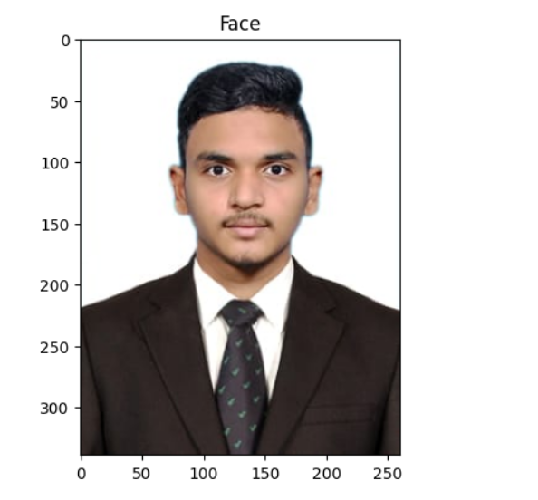
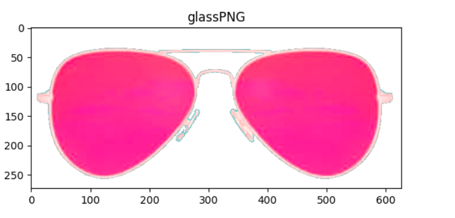
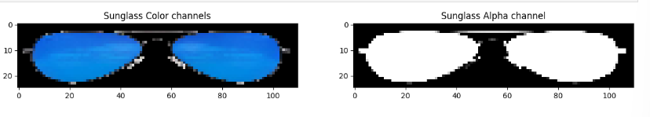
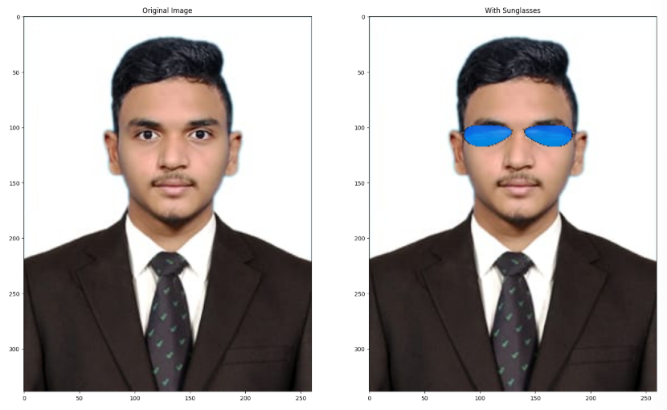

# 😎 Sunglass Overlay on Face Image

A computer vision project that overlays a sunglass PNG onto a face image using OpenCV — demonstrating both naive pixel replacement and alpha-mask-based compositing techniques.


## Overview

This project demonstrates how to overlay a transparent sunglass image onto a face photo using two approaches:

1. **Naive Replacement** — directly overwriting the eye region pixels with the sunglass image.
2. **Alpha Mask Compositing** — using the PNG's alpha channel to blend the sunglass cleanly onto the face, preserving image details around the edges.

---

## Features

- Load and process images with OpenCV
- Handle 4-channel RGBA PNG images (with transparency)
- Resize overlay images to fit a target region
- Perform alpha-mask-based image blending
- Visualize intermediate and final results with Matplotlib

---

## Requirements

Install dependencies via pip:

```bash
pip install opencv-python numpy matplotlib
```

| Library      | Purpose                         |
|--------------|---------------------------------|
| `opencv-python` | Image loading, resizing, blending |
| `numpy`      | Array operations and masking    |
| `matplotlib` | Visualization / display         |

---

## Project Structure

```
├── main_sunglass.ipynb   # Main Jupyter Notebook
├── pic.jpeg              # Input face image
├── sunglass.png          # Sunglass PNG with alpha channel (RGBA)
└── README.md
```

> **Note:** `sunglass.png` must be a PNG with an **alpha channel** (RGBA) for the compositing technique to work correctly.

---

## How It Works

### Step 1 — Load Images
- Face image is loaded as a standard BGR image.
- Sunglass PNG is loaded with the `-1` flag to preserve the alpha channel (`BGRA`).

### Step 2 — Resize Sunglass
The sunglass is resized to `110×25` pixels to fit the eye region of the face image.

### Step 3 — Naive Overlay
The sunglass BGR pixels are directly placed over the eye region (`[95:120, 80:190]`):
```python
faceWithGlassesNaive[95:120, 80:190] = glassBGR
```
This is simple but ignores transparency, so edges look harsh.

### Step 4 — Alpha Mask Compositing
A cleaner blend using the alpha channel:

```python
maskedEye   = cv2.multiply(eyeROI,  (1 - glassMask))   # Remove eye pixels under glass
maskedGlass = cv2.multiply(glassBGR, glassMask)         # Keep only glass pixels
eyeRoiFinal = cv2.add(maskedEye, maskedGlass)           # Combine both
```

This preserves natural edges and creates a realistic composite.

---

## Usage

1. Clone or download the repository.
2. Place your `pic.jpeg` (face image) and `sunglass.png` (RGBA sunglass) in the project directory.
3. Open and run the notebook:

```bash
jupyter notebook main_sunglass.ipynb
```

4. The notebook will display:
   - Original face image
   - Sunglass color and alpha channels
   - Naive overlay result
   - Alpha-composited result (final)

---

## Results









## References

- Sunglass PNG source: [PlusPNG](http://pluspng.com/sunglass-png-1104.html)
- OpenCV Documentation: [docs.opencv.org](https://docs.opencv.org)
